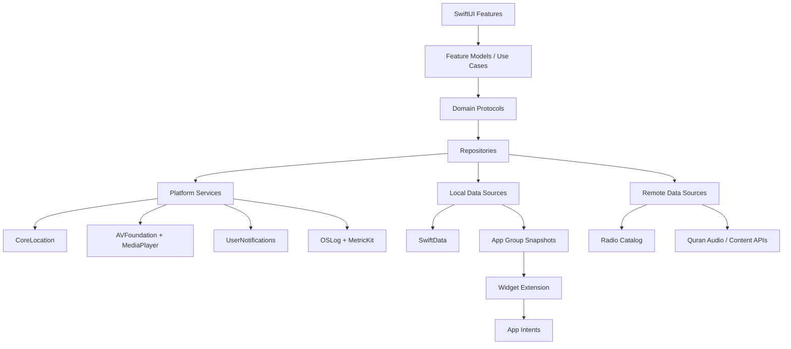
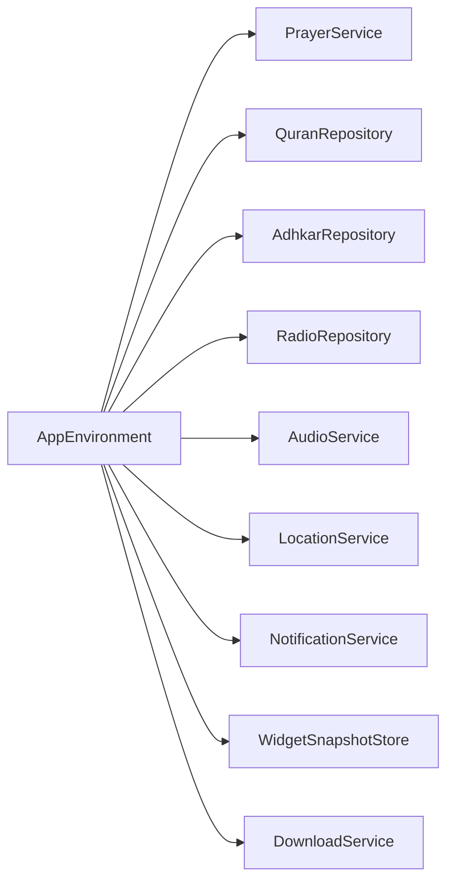
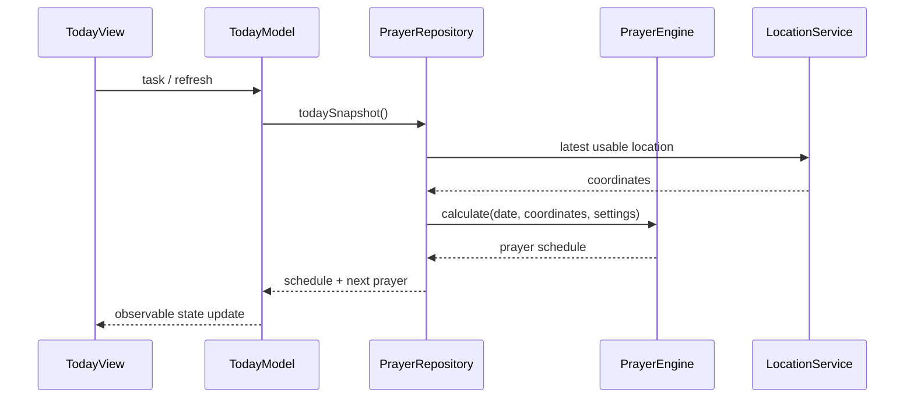
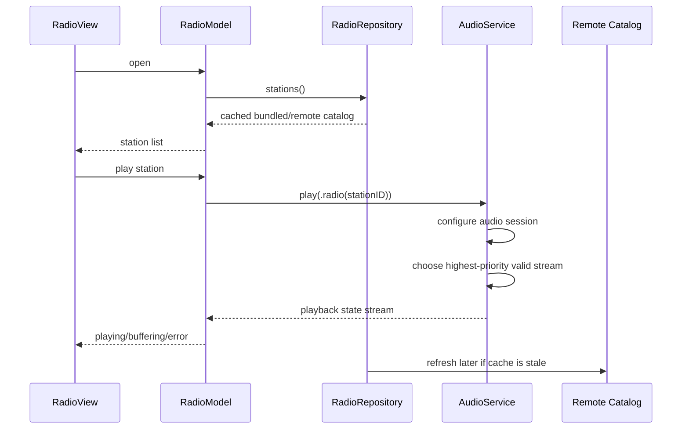
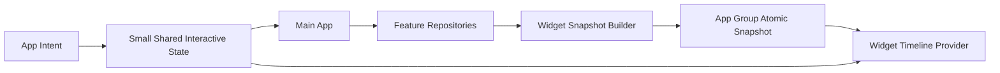

# Islamic Daily Companion — Architecture Blueprint

## Architecture in one sentence

A native SwiftUI iOS 27 application using feature-first clean boundaries, Swift Observation for UI state, actors for shared mutable services, repository protocols for data access, App Group snapshots for widgets, and one shared AVFoundation media engine for Quran audio and live radio.

---

## System Map



---

## Feature ownership

| Feature | Owns | Must not own |
|---|---|---|
| Today | Aggregated presentation | Prayer/Quran algorithms |
| Prayer | Times, tracker, next prayer | Location implementation details |
| Qibla | Heading UI and bearing state | Raw CoreLocation lifecycle |
| Qiyam | Night-window presentation | Notification implementation |
| Quran | Reader, progress, audio intent | Generic AVPlayer ownership |
| Adhkar | Content navigation, counters | Global persistence plumbing |
| Radio | Catalog, favorites, station UX | Direct AVPlayer mutation |
| Settings | User preferences | Feature algorithms |
| Widgets | Glanceable projections | Full app repository graph |

---

## App shell

`IslamicCompanionApp` creates exactly one `AppEnvironment` and injects narrow dependencies into the root router/features.

`RootTabView` contains four tabs:

- Today
- Quran
- Prayer
- Adhkar

Radio opens as a dedicated route and participates in the shared mini-player.

---

## Core service graph



### Long-lived actors

Recommended actor-owned services:

- `AudioService`
- `LocationService`
- `DownloadService`
- `RadioCatalogStore`
- `ContentIntegrityService` if needed

View-facing feature models remain `@MainActor @Observable`.

---

## Data flow example: Next Prayer



No network is required for the calculation once location/settings are known.

---

## Data flow example: Radio



---

## Shared audio engine

Quran audio and radio must not create independent AVPlayer ownership.

Use one media engine:

```text
AudioService
├── currentSource
│   ├── Quran
│   └── Radio
├── AVPlayer
├── AVAudioSession coordination
├── Now Playing metadata
├── Remote Command Center
├── interruption handling
├── route-change handling
└── playback-state AsyncStream
```

Switching source tears down the previous source cleanly.

---

## Radio catalog design

The app bundle contains a safe fallback `radio_catalog.json` with station metadata. Production also supports a remotely versioned catalog.

```json
{
  "schemaVersion": 1,
  "generatedAt": "2026-09-29T00:00:00Z",
  "stations": [
    {
      "id": "quran-radio-cairo",
      "name": "Quran Radio Cairo",
      "frequencyMHz": null,
      "category": "quran",
      "isFeatured": true,
      "isEnabled": true,
      "streams": []
    }
  ]
}
```

Live stream URLs are populated only after source/legal/technical verification.

Initial station candidates:

- Quran Radio Cairo
- Radio Masr 88.7
- Nogoum FM 100.6
- Nile FM 104.2
- El Radio 9090 90.9
- Mega FM 92.7
- Nagham FM 105.3
- Sha3by FM 95.0
- Radio Hits 88.2

---

## Widget data architecture

Do not let each widget instantiate the whole app.

The main app periodically writes a small atomic `WidgetSnapshot` to the App Group.



Widget refreshes are scheduled around meaningful changes (next prayer boundary, state change), not with a continuously running timer.

---

## Persistence ownership

### SwiftData

Store:

- prayer history
- Quran bookmarks
- reading progress/history
- download metadata
- radio favorites/recent stations
- user settings/history that need querying

### App Group shared store

Store only small cross-process projections:

- current daily prayer states
- next prayer widget snapshot
- Quran daily-progress summary
- Adhkar summary
- Qiyam time summary
- last station ID

---

## Error architecture

Infrastructure errors are translated into domain errors before reaching views.

```text
URLError / AVError / CoreLocation error
              ↓
Infrastructure adapter
              ↓
Domain error
              ↓
Feature state
              ↓
User-facing recovery UI
```

Examples:

- `RadioError.stationUnavailable`
- `RadioError.noPlayableStream`
- `LocationError.permissionDenied`
- `QuranAudioError.assetUnavailable`
- `PersistenceError.writeFailed`

Views never need to understand low-level NSError codes.

---

## Performance model

### Launch

- render cached Today state immediately
- start refresh tasks after first frame
- do not decode full Quran data on launch
- do not probe every radio station on launch

### Quran

- page/range-based loading
- bounded prefetch window
- cached parsed data
- no duplicate page models in navigation state

### Radio

- metadata catalog is tiny
- audio is streamed by AVPlayer
- artwork is downsampled and bounded-cached
- one player instance

### Widgets

- consume small precomputed snapshots
- no network request in timeline rendering path unless explicitly justified

---

## Test pyramid

```text
          UI / Device tests
        Integration tests
   Pure domain/unit tests
```

Most logic should be testable without an iPhone or network.

Release blockers include:

- deterministic prayer/Qibla/Qiyam test failures
- Quran integrity failure
- repeatable crash
- memory leak with monotonic growth
- radio playback that cannot recover from a dead stream
- widget action that corrupts shared state

---

## First implementation milestones

1. Foundation + approved design system
2. Prayer engine + Today
3. Prayer tracker + notifications
4. Quran reader + progress
5. Quran audio + shared media engine
6. Adhkar + Qiyam + Qibla
7. Widget extension + App Intents
8. Radio catalog + Radio player
9. offline/error hardening
10. Instruments/accessibility/device QA

